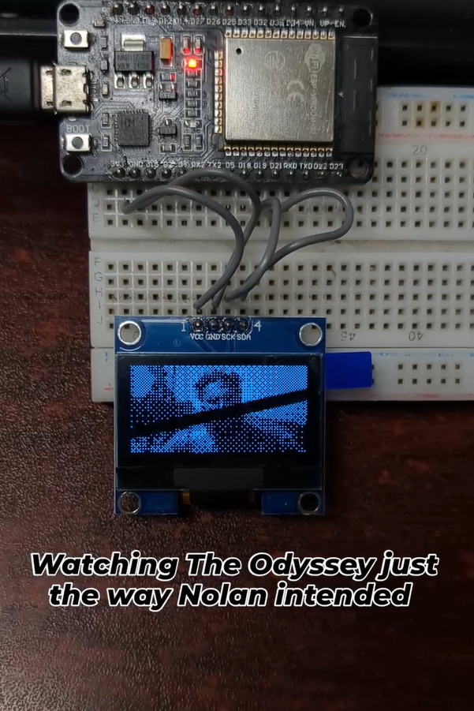

# ESP32 OLED Video Streamer



[**🎬 Watch the Demo Video Here**](https://www.instagram.com/p/Dcb6eYMzGnT/)
Stream any full-motion video directly from your desktop to an ESP32 hooked up to a 1.3" 128x64 I2C OLED screen! 

This project consists of two parts: a high-speed Python script that decodes, downscales, and dithers video in real-time, and a highly optimized C++ firmware for the ESP32 that blasts the data to the OLED screen via raw I2C commands (bypassing slow Adafruit libraries). 

## 🌟 Features

- **Real-Time Video Processing**: Decodes `.mp4`, `.mkv`, `.avi` and more via OpenCV.
- **Bayer Ordered Dithering**: Converts 24-bit color video into crisp 1-bit black and white pixels for the OLED.
- **Unified Interactive UI**: Shows a desktop preview of the original video and the simulated OLED output side-by-side. 
- **Playback Controls**: Features a clickable seek trackbar, on-screen `<< 10s` / `10s >>` buttons, and keyboard shortcuts (`a` and `d`) to scrub through your video.
- **Handshake Protocol**: Utilizes a strict `ACK` handshake mechanism over Serial (at a blistering 1,000,000 baud rate) to ensure the ESP32's buffer never overflows, guaranteeing smooth framerates.
- **SH1106 Support**: The ESP32 firmware accounts for the 132-column memory mapping typical of 1.3" OLEDs, ensuring the image is perfectly centered with no pixelated artifacts on the edges.

## 🛠️ Hardware Requirements

- **ESP32 Development Board**
- **1.3" I2C OLED Display (128x64)** (typically using the SH1106 controller)

### Wiring
| OLED Pin | ESP32 Pin |
|----------|-----------|
| VCC      | 3.3V      |
| GND      | GND       |
| SCL      | D19       |
| SDA      | D21       |

## 🚀 Setup Instructions

### 1. Flash the ESP32 Firmware
The ESP32 firmware is built using PlatformIO. 
1. Open the `node_code` folder in VS Code with the PlatformIO extension installed.
2. Build and upload the project to your ESP32.
3. Upon booting, your OLED should immediately display a **"Hello, World!"** splash screen.

### 2. Install Python Dependencies
Make sure you have Python 3 installed. Navigate to the root directory and install the requirements:
```bash
pip install -r requirements.txt
```

### 3. Run the Streamer
Before running, open `stream_video.py` and ensure the `COM_PORT` variable at the top matches your ESP32's actual COM port (e.g., `COM8` on Windows, `/dev/ttyUSB0` on Linux/Mac).

Run the script:
```bash
python stream_video.py
```
A file dialog will appear. Select your video file, and enjoy the show on your OLED!

## 🎮 Controls

While the video is streaming, you can interact with the desktop preview window:
- **Click & Drag**: Use the trackbar at the top to jump to any part of the movie.
- **On-Screen Buttons**: Click the `<< 10s` and `10s >>` buttons with your mouse to skip.
- **Keyboard Shortcuts**: 
  - `d`: Skip forward 10 seconds.
  - `a`: Skip backward 10 seconds.
  - `q`: Quit the application.

## ⚠️ Notes
- When seeking via the trackbar or buttons in highly compressed videos (like `.mkv`), the video might snap to the nearest "Keyframe" rather than the exact millisecond. This is a normal behavior of video compression.
